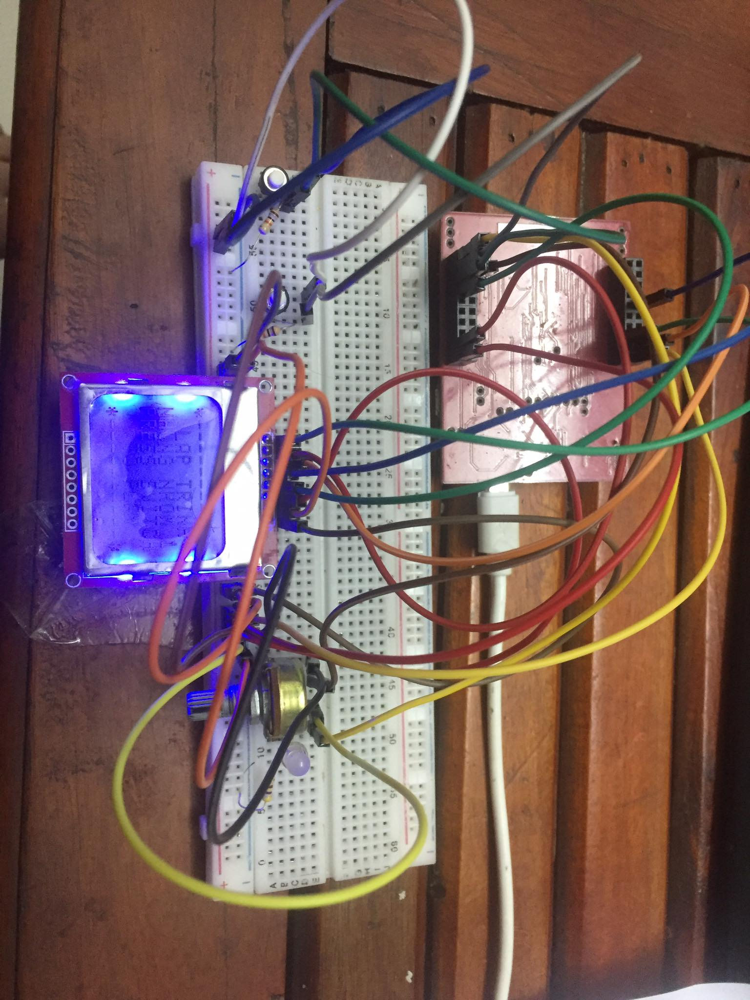
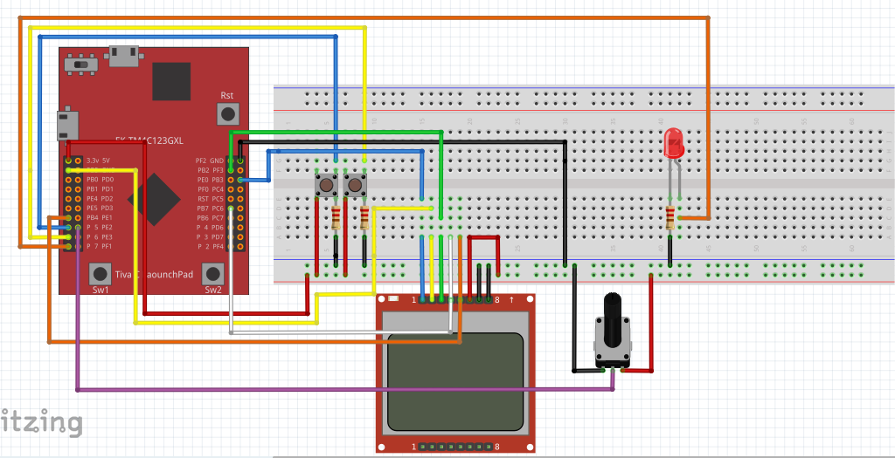

# SPACE-INVADERS-AND-ROAD-FIGHTER-FREERTOS-TIVA-C
## Table Content
[I.Description](#Description)

[II.Game-Instructions](#Game)

[III.Putting It Together](#PuttingItTogether)
- [1.Bill of Materials](#BillofMaterials)
- [2.Wiring](#Wiring)
- [3.Display](#Display)
- [4.Potentiometer and buttons](#4)

[IV.Software-and-Hardware-Used](#Software-and-Hardware-Used)

===========================

### I.Description
This is a my final project at course Embedded System Progamming at HCMUT. The project idea is to make Space Invaders game with my LaunchPad to apply all concepts that teached through this course like ADC,GPIO,Interrupts,SPI,Timer,FreeRTOS...etc. Only Demo, not Professional. 

### II.Game-Instructions
The game consists two games.At 1st game you have to kill 15 enemies. Enemies will try to kill you by their laser shoots so you need to dodge it and kill enemies before you are be killed or enemies reaches bottom line. You have Fire button, POT(to change resistor value) to move, LCD to visualize the game and a special button to clear all laser on screen (but need time to charge). 
At 2nd game you control a car on the road. Your mission try to dodge all vehicle going in the opposite direction. This game like survival mode. No score this game will run idenfinitely if you don't die :v 

### III.Putting It Together

#### 1.Bill of Materials
- [TM4C123GXL - LAUNCHPAD Tiva C](https://www.ti.com/tool/EK-TM4C123GXL)
 

- [Nokia 5110 LCD](https://www.sparkfun.com/products/10168)
 

- [Potentionmeter 10K Ohm](https://www.amazon.com/Best-Sellers-Potentiometers/zgbs/industrial/306810011)
- [Buttons](http://www.eu.diigiit.com/mini-pushbutton-switch)
- [Jumper wire male male](https://www.amazon.com/Solderless-Flexible-Breadboard-Jumper-Arduino/dp/B00ARTWJ44)

#### 2.Wiring

#### 3.Display
- 1 -> PB3
- 2 -> PB5
- 3 -> PB2
- 4 -> PB7
- 5 -> PB4
- 6 -> 3V3
- 7 -> GND
- 8 -> GND

#### 4.Potentiometer and buttons
- POT -> PE2
- BUTTONS -> PA5,PA6
- LED -> PA7

### IV.Software-and-Hardware-Used
- This project is completly wrriten in C and run and tested at CCS.
- To run and test this project you only must have Tiva c, Nokia 5110 LCD, 2 Buttons, 1 Led, and potentiometer.
